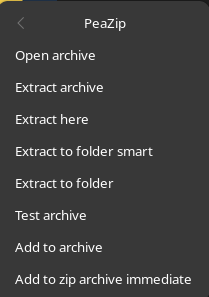

# Nautilus extension for PeaZip

## **This extension currently only works with the flatpak version of PeaZip!**
### Tested Nautilus version: 45.2.1

This extension adds a simple context menu to Nautilus:

## Installation
1) Install [Nautilus Python](https://wiki.gnome.org/Projects/NautilusPython)
    * Debian: `apt install python-nautilus`
    * Fedora: `dnf install nautilus-python`
2) Download `nautilus-peazip.py` and put it in the folder: `~/.local/share/nautilus-python/extensions/` (create the folders if they do not exist)
3) Restart Nautilus (`nautilus -q`)

## Alternative
It is also possible to archive a similar context menu using Nautilus scripts.
See the 'FreeDesktop_integration' folder in the PeaZip program folder for more information about this.